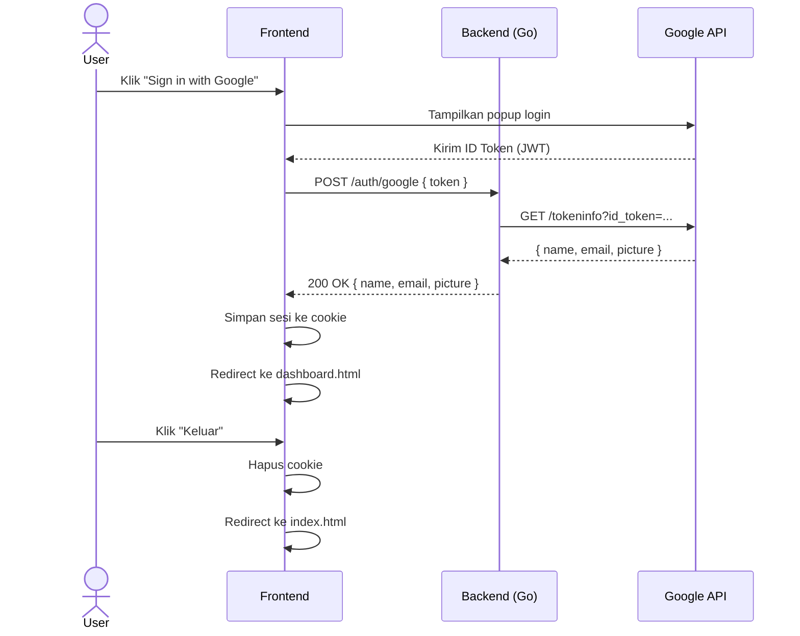

# Google Auth App

Aplikasi web sederhana untuk autentikasi menggunakan Google Sign-In. Dibangun dengan Go (backend) dan vanilla JavaScript menggunakan library [crootjs](https://github.com/jscroot/lib) (frontend).

## Fitur

- Login dengan akun Google via Google Identity Services
- Verifikasi token di sisi server menggunakan Google Token Info API
- Simpan sesi login ke cookie (expire 1 hari)
- Dashboard profil pengguna setelah login
- Proteksi halaman — redirect otomatis jika belum/sudah login
- Logout dan hapus sesi

## Diagram Alur



## Struktur Project

```
.
├── backend/
│   ├── handler/
│   │   └── auth.go       # Handler: /auth/google, /auth/me, /auth/logout
│   ├── middleware/
│   │   └── cors.go       # Middleware CORS
│   ├── go.mod
│   └── main.go           # Entry point, routing
└── frontend/
    ├── index.html         # Halaman login
    ├── index.js           # Logic login & Google callback
    ├── dashboard.html     # Halaman dashboard (protected)
    ├── dashboard.js       # Logic dashboard & logout
    └── style.css          # Styling semua halaman
```

## Teknologi

| Bagian | Teknologi |
|---|---|
| Backend | Go 1.21, `net/http` (stdlib) |
| Frontend | HTML, CSS, Vanilla JS |
| Auth | Google Identity Services (GSI) |
| JS Library | crootjs (cookie, url, element) |

## Menjalankan Lokal

**Backend:**

```bash
cd backend
go run .
# Server berjalan di http://localhost:8080
```

**Frontend:**

Buka `frontend/index.html` lewat live server (VS Code Live Server, dll).

Pastikan `BACKEND_URL` di `index.js` mengarah ke `http://localhost:8080`.

## Deploy ke AlwaysData

**1. Build binary Linux:**

```bash
cd backend
set GOOS=linux && set GOARCH=amd64 && go build -o server .
```

**2. Upload via SFTP** ke `ssh-<username>.alwaysdata.net` (port 22):
- Frontend → `~/www/`
- Binary → `~/backend/server`

**3. Beri permission:**

```bash
chmod +x ~/backend/server
```

**4. Konfigurasi di panel admin.alwaysdata.com:**
- Site frontend: type **Static files**, root `~/www/`
- Site backend: type **Program**, command `/home/<username>/backend/server`

**5. Update `BACKEND_URL`** di `index.js` ke URL backend production, lalu re-upload.

## API Endpoints

| Method | Endpoint | Deskripsi |
|---|---|---|
| POST | `/auth/google` | Verifikasi Google ID Token, kembalikan data user |
| GET | `/auth/me` | Verifikasi token dari header Authorization |
| POST | `/auth/logout` | Konfirmasi logout (sesi dikelola di client) |
